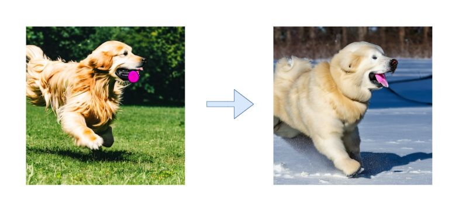

# The-Winter-is-Coming
# ❄️ Stable Diffusion Prompt Steering: WINTER Injection via Activation Patching  

> *Exploring activation-based steering for controllable diffusion generation.*  

---



---

## 🌌 Overview  

This project investigates how **targeted changes to intermediate activations** can bias diffusion sampling toward a desired concept — in this case **“WINTER”** — without retraining.  

By applying a **per-layer epsilon schedule** across the text encoder, we nudge the U-Net during latent denoising, then decode final results with the VAE for evaluation.  

---

## ✨ Key Features  

- 🧩 **Activation Patching** → Inject *“WINTER”* while preserving original prompt semantics.  
- 📊 **Per-Layer Epsilon Ramp** → Fine-grained modulation across ~23 encoder layers.  
- ⚡ **Batch Generation** → Reproducible outputs with structured naming & logging.  
- 🖼️ **Side-by-Side Grids** → HTML comparison of steered vs. baseline generations.  
- 🛡️ **Robust Iteration** → Handles missing artifacts.  

---

## ⚙️ How It Works  

### 🔤 **Text Encoder**  
- Encodes the input prompt.  
- A **steering vector slice** is injected into MLP outputs per layer.  
- Scaled by **ε (epsilon)** values from the per-layer schedule.  

### 🌀 **U-Net**  
- Performs **latent denoising** guided by both:  
  - Original text embedding.  
  - Altered activations with steering applied.  

### 🎨 **VAE Decoder**  
- Transforms refined latents back into pixel space.  
- Produces **qualitative outputs** to study steering strength vs. semantic fidelity.  

---

## 🚀 **Usage**

1. **Clone repository**

```bash
git clone https://github.com/zimmy11/The-Winter-is-Coming.git
cd The-Winter-is-Coming
```

2. **View Results**

- Outputs saved in ```outputs/```
- Open the generated HTML grid for visual comparisons
